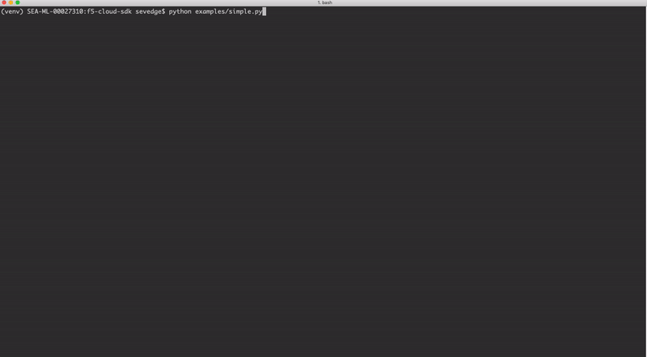

F5 CLoud SDK (Python) documentation
===================================

Introduction
============

This project provides a use case focused python SDK for interacting with F5 products, specifically around cloud and automation.  The UX closely mirrors established, successful SDK's such as the Azure, AWS, and Google SDK's.

Table of Contents
=================

.. toctree::
   :maxdepth: 1

   quickstart/index
   userguide/index
   developerguide/index
   apidocs/index
   examples/index

Supported Platforms
-------------------

- Linux (Major distros)
- Mac OS (future, for official support)
- Windows (future, for official support)

Source
------

Source documentation `here <https://clouddocs.f5.com/>`_.